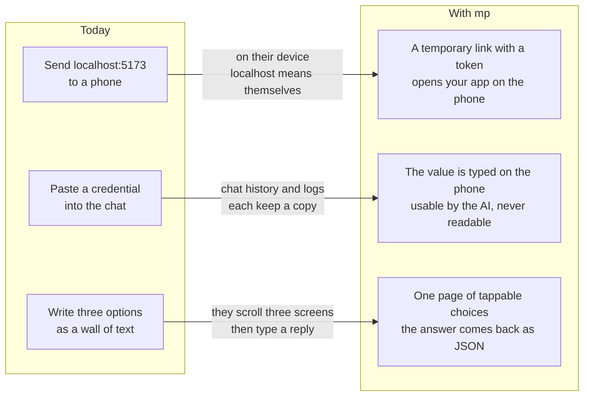

# mobile-preview manual

中文版：[中文手册](../index.md)

## Where you are stuck today

## One job, one command

| What you want | Command | What you get |
|---|---|---|
| Open the local app on a phone | `mp start` | An HTTPS link carrying a token, closing itself after 30 minutes by default |
| Let the AI use a credential it cannot read | `mp secret ask` | The value is typed on the phone, injected into the command, scrubbed from output (evidence E005) |
| Ask a question without a wall of text | `mp interaction ask` | A tappable page on the phone; the answer returns as JSON |
| Let the AI reach for these on its own | Install the plugin | No command typing in a remote session (evidence E001) |

## What it looks like on the phone

Evidence E010:

Legend: this image is a real artifact produced by `mp capture`, not a mockup.

## What to read, in what order

| Where you are | Read this |
|---|---|
| Nothing installed yet | [Quickstart](./quickstart.md) |
| Installed, want daily use | [Show the app on a phone](./workflows/preview-and-capture.md) |
| The AI needs your credential, or needs you to choose | [Credentials and decisions](./workflows/secrets-and-decisions.md) |
| Looking up a flag | [Command reference](./reference/commands.md) |
| Something broke | [Troubleshooting](./troubleshooting.md) |

## Two things to know first

**In Windows PowerShell, write `mp.cmd`.** PowerShell takes `mp` as an alias for the built-in
`Move-ItemProperty`, so a bare `mp` runs something unrelated. CMD, Git Bash, macOS and Linux
take `mp` directly; this manual writes `mp` throughout, and PowerShell readers substitute.

**The link is the password.** Every link carries a 32-byte token, and without it every request
gets a 404 (evidence E007). Forwarding the link hands over the preview; there is no second
login.

## Scope

**Covered**: installation and self-check, previews, screenshot and video diagnostics, the
credential relay, decision pages, every command flag, troubleshooting.

**Not covered**: source architecture, contribution flow and design rationale, which live in
`README.md` and `docs/superpowers/specs/`; the plugin hook configuration, which lives in
`plugins/mobile-preview/README.md`.

This manual is written against 0.5.3. Run `mp --version` for the one you have (evidence E002).
