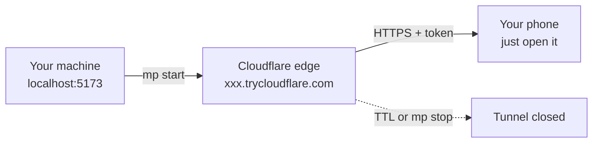

# mobile-preview manual

中文版：[中文手册](../index.md)

## The problem it solves

You are running a web app on your own machine at `http://localhost:5173`. Only this machine
knows that address. Send it to a phone, to a colleague, or to the AI working for you, and on
their device `localhost` means themselves.

`mp` opens a temporary, password-carrying public tunnel to that local port:

Around that tunnel it solves three related problems: how to hand the AI a credential it may
use but never read; how to ask you a question without it becoming a wall of text; and how to
make the AI reach for these on its own instead of you typing the commands every time.

## What to read, in what order

| Where you are | Read this |
|---|---|
| Nothing installed yet | [Quickstart](./quickstart.md) |
| Installed, want daily use | [Show the app on a phone](./workflows/preview-and-capture.md) |
| The AI needs your credential, or needs you to choose | [Credentials and decisions](./workflows/secrets-and-decisions.md) |
| Looking up a flag | [Command reference](./reference/commands.md) |
| Something broke | [Troubleshooting](./troubleshooting.md) |

## Two things to know first

**In Windows PowerShell the command is `mp.cmd`.** PowerShell takes `mp` as the built-in alias
for `Move-ItemProperty`, so typing `mp` there runs something entirely unrelated. CMD, Git Bash,
macOS and Linux use `mp`. This manual writes `mp`; PowerShell readers substitute.

**The link is the password.** Every link carries a 32-byte token, and anything without it gets
a 404 (evidence E007). Forwarding a link hands over the preview; there is no second login.
A preview closes itself after 30 minutes by default.

## Scope

**Covered**: install and self-check, previews, screenshot and video diagnosis, the secret relay,
decision pages, every command flag, troubleshooting.

**Not covered**: source architecture, contribution flow, design rationale — those live in
`README.md` and `docs/superpowers/specs/`. Plugin hook configuration lives in
`plugins/mobile-preview/README.md`.

This manual is written against 0.5.3. Run `mp --version` for the one you have (evidence E002).
