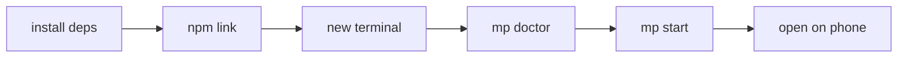

# Quickstart

Work through this page and you end up with a link that opens on your phone. About ten minutes.

## Prerequisites

- Node.js 20 or newer; `node -v` prints a version
- A web project you can run locally, and you know the port it listens on
- Windows PowerShell users: write every `mp` below as `mp.cmd`

## Installing mp

Start: a terminal you can type commands into, any working directory.

1. Fetch the code: `git clone https://github.com/2440893398/mobile-preview.git`,
   then `cd mobile-preview`.
2. Install dependencies: `npm install`.
3. Install the browser used for screenshots: `npx playwright install chromium`.
4. Install the tunnel client: `winget install --id Cloudflare.cloudflared` on Windows,
   `brew install cloudflared` on macOS.
5. Put `mp` on your PATH: `npm link`.
6. Close this terminal, **open a new one**, and run `mp doctor`.
   - Expected: four lines print `ok`, and the last line reads
     `Everything mp needs is present.` (evidence E008).

The new terminal matters. A shell fixes its executable search path at startup, so the old
window cannot see the `mp` you just linked.

## Running your first preview

Start: `mp doctor` reports `ok` four times, and your app is already running locally
(say, on port 4173).

1. Run `mp start --port 4173`, replacing 4173 with the port your app actually listens on.
2. Wait. The command prints `... starting the preview daemon`, then
   `... asking trycloudflare.com for a quick tunnel`; the link appears only once the edge
   connection is up.
3. Send the printed link to your phone and open it.
4. Run `mp stop` when you are done.
   - Expected: `stopped port 4173 (2 process tree(s) terminated)`, and refreshing on the
     phone no longer loads (evidence E009).

Skipping `mp stop` is fine too: a preview ends itself after 30 minutes by default.

## Verify

Run `mp status`. It worked when `mp start` leaves a slot for that port, with the link, the
remaining time, two process ids and the tunnel log path, and when `mp stop` removes that slot
from the list.

A preview has no window. Nothing appears on the desktop, and `mp status` is the only place
it is visible.

## If it fails

Run `mp doctor` first. It tells apart "not installed", "installed but this shell cannot see
it", and "only ffmpeg is missing, which affects `--video` alone", and prints the command that
fixes each case.

When `mp start` fails after waiting, the full log is at
`%LOCALAPPDATA%\mobile-preview\previews\<port>.cloudflared.log`, with each retry separated by
`--- attempt N/M ---`.

Symptom-by-symptom fixes live in [Troubleshooting](./troubleshooting.md).
