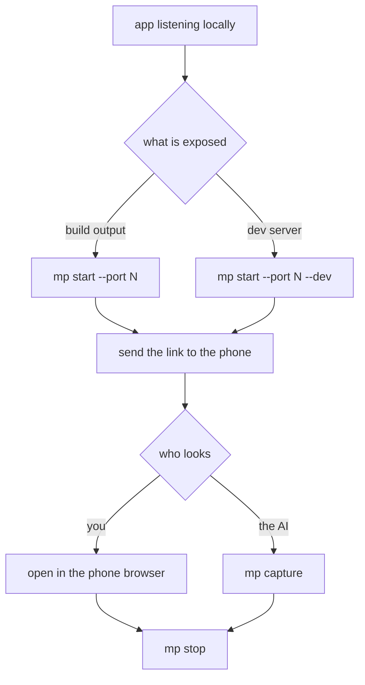

# Show the app on a phone, and let the AI look at it

## Prerequisites

- [Quickstart](../quickstart.md) done, `mp doctor` reports `ok` four times
- Your app is running locally and you know its port



## Opening a preview

Start: a terminal in any directory, with your app listening on a local port.

1. Run `mp start --port <your port>`.
2. Add `--dev` when what you expose is a dev server (Vite, Webpack dev server) rather than a
   build.
3. Add `--ttl <minutes>` for a longer or shorter lifetime; the range is 1 to 1440.
4. Send the printed link to your phone and open it.
   - Expected: the command prints
     `preview: https://….trycloudflare.com/?__mp_token=…` and `expires in 30 min`, and the
     phone shows the same page as the desktop (evidence E009).

This is what it looks like on the phone:


## Letting the AI look at the page

Start: one preview is running and `mp status` lists it.

1. Run `mp capture`. With a single preview running you need no port.
2. Add `--network-idle` for API-driven single-page apps, so the shot waits for the network to
   settle.
3. Add `--full-page` for the whole scrollable page rather than the first screen.
4. Add `--video` to record instead of shoot; it needs ffmpeg on PATH.
   - Expected: one line of ``, followed by
     `Page loaded clean: no console errors, no failed requests.` or a list of what the page
     reported (evidence E009).

The output is Markdown image syntax, so pasting it to an AI is enough for it to see the shot.
Console errors and failed requests come back in the same report, which is the whole point of
handing diagnosis to the AI.

## Running several previews at once

One port takes one slot, so a front end and an admin panel can each have their own. With a
single preview running, `mp capture` and `mp stop` default to it; past one, they refuse to
guess:

```text
$ mp capture
several previews are active (ports 4173, 4180). Pass --port to pick one.
```

Pass `--port` explicitly at that point (evidence E009).

## Two known limits with dev servers

The tunnel does not forward WebSocket upgrades, so Vite hot reload does not work through a
preview. Edit your code, then refresh the phone by hand.

For the same reason a page relying on SSE looks broken through a preview: events pile up until
the connection closes.

## Verify

Run `mp status`: a working preview shows its slot, link and remaining time; after `mp stop`
the slot is gone from the list and the phone no longer loads the page.

## If it fails

When the link never appears or the attempt fails, read the failure class the command prints,
then `%LOCALAPPDATA%\mobile-preview\previews\<port>.cloudflared.log`.

A 530 on the phone means the tunnel dropped after coming up; run `mp start` again, as mp does
not reconnect on its own. A 404 means the link lost its token or expired; take the current one
from `mp status`.

More symptoms in [Troubleshooting](../troubleshooting.md).
