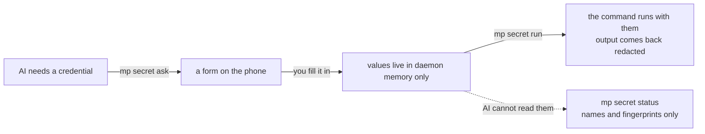

# Hand over credentials and decide on the phone

Both problems share a root: the AI needs input from you, and a chat box is the worst place to
put it. Passwords end up in the transcript, and a choice turns into a screen of prose.

## Prerequisites

- `mp` installed, `mp doctor` reports `ok` four times
- Your phone can open `trycloudflare.com` links



## Handing a credential to the AI

Start: a terminal in your project, with the AI having told you which command it wants to run.

1. Open a form:
   `mp secret ask --purpose "deploy needs cloud AccessKey" --field AK --field SK --use "npm run deploy"`.
2. Send the printed link to your phone and fill it in. Every command declared with `--use` is
   ticked off by you on the phone.
3. Run `mp secret wait` until the phone submits.
4. Run `mp secret run -- npm run deploy`. The values arrive as environment variables and the
   output comes back redacted.
5. Run `mp secret forget --all` when you are done.
   - Expected: it prints `forgot 1 secret slot(s)` and the values leave memory (evidence E011).

`mp secret status` only ever lists field names, approved uses and remaining time — **never
values**. Values stay in memory for 120 minutes by default, and the form link stays open for 30.

## Turning a choice into a page

Start: a decision that is yours to make, with more than two options or something to compare.

1. Write a self-contained HTML file: one file, no external resources, no `<form action>`.
2. Give each control a `name` and the submit button `data-mp-submit`. Add a second button
   carrying `data-mp-disposition="needs_clarification"` so you can answer that the question
   itself is wrong.
3. Run `mp interaction ask --purpose "which environment" --html ask-env.html`.
4. Send the link to your phone and submit your choice.
5. Run `mp interaction wait` to collect the answer, printed as JSON.
   - Expected: before the phone submits it prints
     `i-xxxxxx: still waiting — the link is open for 30 more min.` and exits 0; a timeout is
     not a failure (evidence E011).

The page is checked before any link is issued, and a page that fails is refused:

```text
$ mp interaction ask --purpose "which environment" --html ask-env.html
ask-env.html does not meet the interaction page contract:
  - nothing carries `data-mp-submit`, so the page has no way to submit
```

That refusal is real output (evidence E011). The full page contract is in
`docs/superpowers/specs/2026-09-16-interaction-page-contract.md`.

## When the phone cannot submit

Tunnels drop. cloudflared loses the edge and re-registers twenty-odd seconds later, and a
submission that lands in that window never reaches this machine: what comes back is
Cloudflare's own error page rather than this machine's JSON. The page used to say only "that
did not go through, try again" — while the answer was still on the phone's screen and the only
way forward was to ask for a new link and fill the whole page in again.

There are now two fallbacks, both in the page, and neither needs anything from you or from the
person holding the phone:

- **The page retries itself.** A submission that did not arrive is resent five times over
   about half a minute (1.2s, 2.5s, 5s, 10s, 18s). An answer is deduplicated by its submission
   id, so the attempt that gets through after a reconnect comes back with the same receipt
   rather than filing a second answer, and an answered link is held open a little longer for
   exactly these late retries. Across a twenty-second outage the phone sees "retrying", then
   the receipt.
- **Handing the answer back as text.** When the retries run out, or this machine says outright
   that it will not take the submission, the page turns the answer into something pasteable,
   with a copy button:

   ```text
   【mp interaction 回传 · i-20387a · 第 1 版】
   手机上没能把答案交回你的机器。下面就是我的回答，按它继续，不用再发新链接。

   - 文档形态：整套镜像（mirror）
   - 备注：先做中文

   mp-answer: {"id":"i-20387a","revision":1,"disposition":"answered","reason":null,"answers":{"doc":"mirror","note":"先做中文"}}

   收到后收个尾：mp interaction close --id i-20387a
   ```

   (The block is Chinese, like every other phone-facing string in this tool.) Pasting it
   into the chat counts as answering the page. The first lines are for a person to
   read, the `mp-answer:` line is for the agent to parse. An agent that receives one acts on it
   and runs `mp interaction close --id <id>` to tidy up; it should not send a new link and make
   someone fill the same page in twice.

A page can put its own button on this: `MP.handoff()` returns the text, `MP.rescue()` opens the
panel.

## When several are open at once

`secret` and `interaction` both take a slot keyed by a random id. With one slot left open,
`wait` / `forget` / `close` need no `--id`; past one they refuse to guess and print
`several interactions are open (i-2b944d, i-f1ed0b); pass --id.`

## Verify

`mp secret status` lists slots, field names and remaining time and contains no values.
`mp interaction status` lists open questions, their stage and how much is filled in. Both
lists are empty after `forget --all` and `close --all`.

## If it fails

When the link never comes out, the tunnel is the usual cause rather than the command; the fix
is the same as for previews, see [Troubleshooting](../troubleshooting.md).

When a page is refused, the command lists each failing rule. Fix them and run it again —
nothing goes live, so no half-built link escapes.
