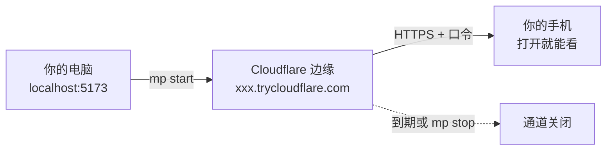

# mobile-preview 操作手册

English version: [English manual](./en/index.md)

## 它解决的问题

你在自己电脑上跑着一个网页应用，地址是 `http://localhost:5173`。这个地址只有这台电脑认得。
发给手机、发给同事、发给正在帮你干活的 AI，在对方设备上 `localhost` 指的是对方自己。

`mp` 给这个本地端口开一条临时的、带口令的公网通道：

围绕这条通道，它还解决三件同源的事：本机的密钥怎么交给 AI 用而不被它读到；一个需要你做的
选择怎么问才不变成一屏文字；以及怎么让 AI 自己想到用这些，不用你每次手敲。

## 按什么顺序读

| 你的状态 | 读这页 |
|---|---|
| 还没装 | [快速上手](./quickstart.md) |
| 装好了，想天天用 | [把应用开给手机看](./workflows/preview-and-capture.md) |
| AI 要用你的密钥，或者要你做选择 | [交出密钥与做选择](./workflows/secrets-and-decisions.md) |
| 查参数 | [命令速查](./reference/commands.md) |
| 出问题了 | [排错](./troubleshooting.md) |

## 两件必须先知道的事

**在 Windows PowerShell 里命令要写成 `mp.cmd`。** PowerShell 把 `mp` 占用为内置命令
`Move-ItemProperty` 的别名，直接敲 `mp` 会执行完全无关的东西。CMD、Git Bash、macOS 与
Linux 直接写 `mp`。本手册统一写 `mp`，PowerShell 读者自行替换。

**链接即密码。** 每条链接里带一个 32 字节口令，没有它一律返回 404（证据 E007）。把链接转发给谁，
就等于把这个预览给了谁；它没有二次登录。预览默认 30 分钟后自己关闭。

## 范围边界

**覆盖**：安装与自检、预览、截图与录像诊断、密钥中继、决策页、全部命令参数、排错。

**不覆盖**：源码架构、贡献流程、设计推导，这些在 `README.md` 与 `docs/superpowers/specs/`；
插件 hooks 的配置细节在 `plugins/mobile-preview/README.md`。

本手册基于 0.5.3 写成。你装的是哪一版，用 `mp --version` 查（证据 E002）。
