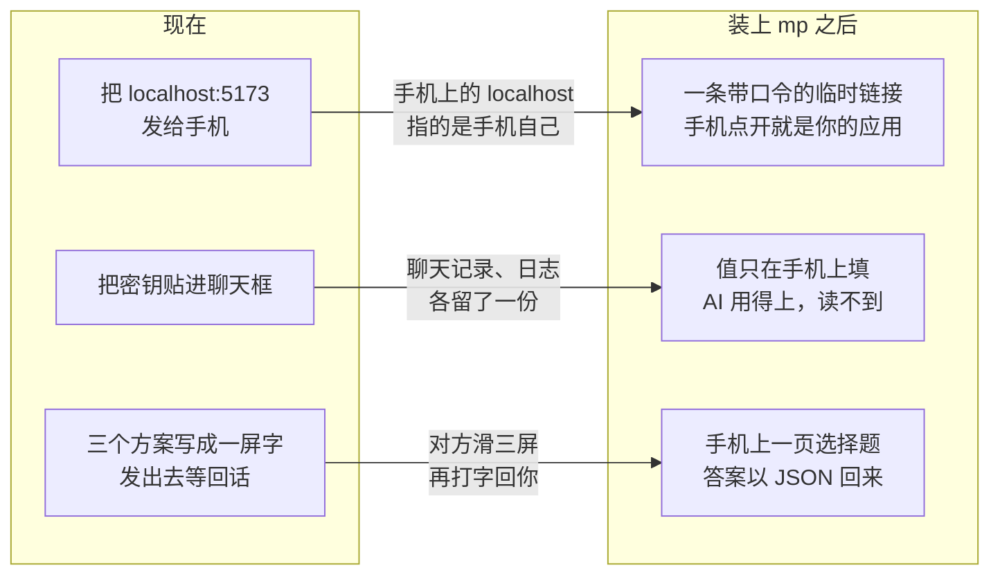
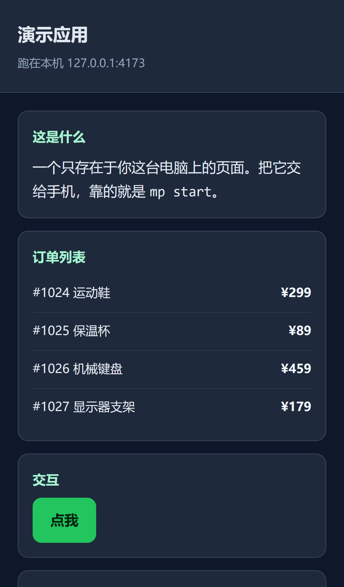

# mobile-preview 操作手册

English version: [English manual](./en/index.md)

## 你现在是怎么卡住的

## 一件事对一条命令

| 你想做的 | 命令 | 拿到什么 |
|---|---|---|
| 让手机打开本机应用 | `mp start` | 一条带口令的 HTTPS 链接，默认 30 分钟后自动关闭 |
| 让 AI 用你的密钥但读不到 | `mp secret ask` | 值在手机上填，注入命令环境，输出脱敏（证据 E005） |
| 让一个选择题别变成一屏字 | `mp interaction ask` | 手机上一页可点的页面，答案以 JSON 回到 AI 手里 |
| 让 AI 自己想起来用这些 | 装插件 | 远程会话里不必你每次手敲（证据 E001） |

## 手机上看到的样子

证据 E010：

图例：这张图是 `mp capture` 拍下来的真实产物，不是示意图。

## 按什么顺序读

| 你的状态 | 读这页 |
|---|---|
| 还没装 | [快速上手](./quickstart.md) |
| 装好了，想天天用 | [把应用开给手机看](./workflows/preview-and-capture.md) |
| AI 要用你的密钥，或者要你做选择 | [交出密钥与做选择](./workflows/secrets-and-decisions.md) |
| 查参数 | [命令速查](./reference/commands.md) |
| 出问题了 | [排错](./troubleshooting.md) |

## 两件必须先知道的事

**在 Windows PowerShell 里命令要写成 `mp.cmd`。** PowerShell 把 `mp` 占用为内置命令
`Move-ItemProperty` 的别名，直接敲 `mp` 会执行完全无关的东西。CMD、Git Bash、macOS 与
Linux 直接写 `mp`；本手册统一写 `mp`，PowerShell 读者自行替换。

**链接即密码。** 每条链接里带一个 32 字节口令，没有它一律返回 404（证据 E007）。
把链接转发给谁，就等于把这个预览给了谁，它没有二次登录。

## 范围边界

**覆盖**：安装与自检、预览、截图与录像诊断、密钥中继、决策页、全部命令参数、排错。

**不覆盖**：源码架构、贡献流程、设计推导，这些在 `README.md` 与 `docs/superpowers/specs/`；
插件 hooks 的配置细节在 `plugins/mobile-preview/README.md`。

本手册基于 0.5.3 写成。你装的是哪一版，用 `mp --version` 查（证据 E002）。
