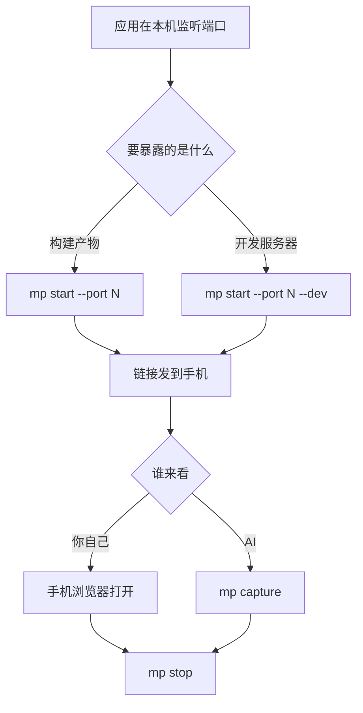

# 把应用开给手机看，并让 AI 替你看页面

## 前置条件

- 已完成[快速上手](../quickstart.md)，`mp doctor` 四项全 `ok`
- 目标应用已在本机运行，你知道它监听的端口



## 开一条预览的步骤

起点：终端在任意目录，应用已在本机监听端口。

1. 执行 `mp start --port <你的端口>`。
2. 需要暴露的是开发服务器（Vite、Webpack dev server）而不是构建产物时，加上 `--dev`。
3. 需要更长或更短的有效期时，加上 `--ttl <分钟>`，取值 1 到 1440。
4. 把打印出来的链接发到手机打开。
   - 预期：命令打印 `preview: https://….trycloudflare.com/?__mp_token=…` 与
     `expires in 30 min`；手机上显示的页面与电脑上一致（证据 E009）。

手机上看到的就是这个样子：


## 让 AI 替你看页面的步骤

起点：一条预览正在跑，`mp status` 能看到它。

1. 执行 `mp capture`。只有一条预览在跑时不必指定端口。
2. 页面是 API 驱动的单页应用时，加上 `--network-idle`，等网络静默再拍。
3. 要整页而不只是第一屏时，加上 `--full-page`。
4. 要录像而不是截图时，加上 `--video`，它需要 ffmpeg 在 PATH 上。
   - 预期：打印一行 ``，再打印
     `Page loaded clean: no console errors, no failed requests.` 或列出页面上的报错
     （证据 E009）。

打印出来的是 Markdown 图片语法，贴给 AI 它就能直接看图。页面有控制台报错或失败请求时，
`mp capture` 会一并列出来，这正是"让 AI 替你定位问题"的用法。

## 同时开多个预览

一个端口占一个槽位，前端和后台管理可以各开一条。只有一条预览在跑时，`mp capture` 与
`mp stop` 默认作用于它；一旦超过一条，这两个命令拒绝猜测：

```text
$ mp capture
several previews are active (ports 4173, 4180). Pass --port to pick one.
```

此时必须显式写 `--port`（证据 E009）。

## 开发服务器的两个已知限制

隧道不转发 WebSocket 升级，所以 Vite 的热更新在预览里不工作。改完代码，在手机上手动
刷新页面即可看到新内容。

同样的原因，依赖 SSE 的页面透过预览会像是坏了：事件会一直堆积到连接关闭才送达。

## 验证

执行 `mp status`：开成功时能看到该端口的槽位、链接与剩余时间；`mp stop` 之后该槽位从
列表消失，手机上刷新页面打不开。

## 失败时

链接迟迟不出现或最终失败，先看命令给出的失败分类，再读
`%LOCALAPPDATA%\mobile-preview\previews\<端口>.cloudflared.log`。

手机上打开显示 530，说明隧道建起来之后掉线了，重新执行 `mp start` 即可，本工具不做自动
重连。显示 404 说明链接缺了口令或已过期，用 `mp status` 取当前链接。

更多症状见[排错](../troubleshooting.md)。
