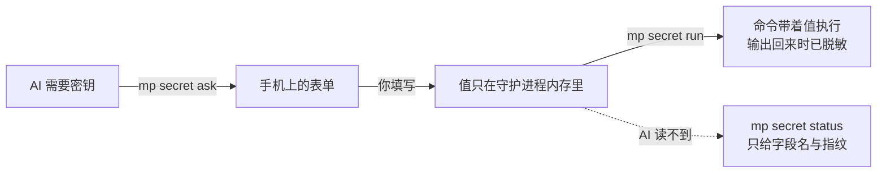

# 交出密钥与在手机上做选择

两件事同源：AI 需要你输入点什么，而聊天框是最糟的输入位置 —— 密码会留在对话记录里，
选择题会变成一屏读不完的文字。

## 前置条件

- 已装好 `mp`，`mp doctor` 四项全 `ok`
- 手机能打开 `trycloudflare.com` 的链接



## 把密钥交给 AI 用的步骤

起点：终端在项目目录，AI 已经告诉你它要跑哪条命令。

1. 开一个表单：
   `mp secret ask --purpose "部署需要云厂商 AccessKey" --field AK --field SK --use "npm run deploy"`。
2. 把打印出来的链接发到手机，填好提交。每条 `--use` 声明的命令都要你在手机上逐条勾选批准。
3. 执行 `mp secret wait`，等手机提交。
4. 执行 `mp secret run -- npm run deploy`，值以环境变量注入，输出回来时已脱敏。
5. 用完执行 `mp secret forget --all`。
   - 预期：打印 `forgot 1 secret slot(s)`，值从内存中消失（证据 E011）。

`mp secret status` 任何时候都只列字段名、已批准的用途与剩余时间，**不打印值**。
值默认在内存里保留 120 分钟，表单链接默认开放 30 分钟。

## 把选择题变成页面的步骤

起点：有一个需要你拍板的选择，且选项多于两个或需要对比。

1. 写一个自包含的 HTML 文件：单文件、不引任何外部资源、不写 `<form action>`。
2. 给每个控件加 `name`，给提交按钮加 `data-mp-submit`；再加一个带
   `data-mp-disposition="needs_clarification"` 的按钮，好让你能回答"问题本身不对"。
3. 执行 `mp interaction ask --purpose "部署环境二选一" --html ask-env.html`。
4. 把链接发到手机，做完选择提交。
5. 执行 `mp interaction wait` 取答案，它以 JSON 打印。
   - 预期：手机还没提交时打印 `i-xxxxxx: still waiting — the link is open for 30 more min.`
     并以退出码 0 结束，超时不算失败（证据 E011）。

页面在发链接之前会被检查，不合规直接拒绝出链接：

```text
$ mp interaction ask --purpose "部署环境二选一" --html ask-env.html
ask-env.html does not meet the interaction page contract:
  - nothing carries `data-mp-submit`, so the page has no way to submit
```

这条拒绝是真实输出（证据 E011）。完整的页面合同见
`docs/superpowers/specs/2026-09-16-interaction-page-contract.md`。

## 同时开着多个时

`secret` 与 `interaction` 都按随机 id 占槽位。只剩一个未关闭时，`wait` / `forget` /
`close` 不必带 `--id`；有多个时它们同样拒绝猜测，打印
`several interactions are open (i-2b944d, i-f1ed0b); pass --id.`。

## 验证

`mp secret status` 列出槽位、字段名与剩余时间，且不含任何值；
`mp interaction status` 列出未关闭的问题、阶段与已填写进度。两个列表在你执行
`forget --all` / `close --all` 之后都应为空。

## 失败时

链接发不出来，多半卡在隧道而不是命令本身，处置与预览相同，见[排错](../troubleshooting.md)。

页面被拒绝时，命令会把不合规的条目逐条列出来，照着改再跑一次即可 —— 页面不上线，
不会有半成品链接流出去。
